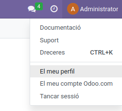
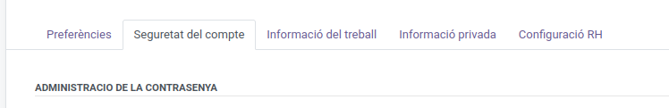

# Api-Odoo

Aquest projecte permet interactuar amb l'API d'Odoo mitjançant XML-RPC.

## Obtenir la clau d'API

Per obtenir la clau d'API, segueix aquests passos:

1. Ves a Odoo i fes clic al teu perfil.
   

2. Tria l'opció "El meu perfil".
   

3. Ves a la pestanya "Seguretat al compte".
   

4. Afig una clau d'API.
   


## Configuració

Assegura't de configurar correctament el fitxer `config.yml` amb les dades de connexió adequades per als entorns de producció i desenvolupament.
```yaml
production:    
    connection:
        url: https://dominiodoo.es
        port: 443
        db: nom_bd
        user: usuari
        password: **********47d1e3ac55**********

development:    
    connection:
        url: http://localhost
        port: 8069
        db: nom_bd
        user: usuari
        password: **********47d1e3ac55**********
```

## Executar el script

Per executar el script `main.py`, assegura't d'estar en un entorn Python 3.5 o superior. Pots seguir aquests passos:

1. Instal·la les dependències necessàries:
   ```sh
   pip install pyyaml
   ```
2. Executa el script:
   ```sh
   python3 main.py
   ```

Això llegirà les propietats de connexió des del fitxer `config.yml` i construirà la URL base per a XML-RPC.

## Contribuir

Si vols contribuir a aquest projecte, si us plau, fes un fork del repositori i envia una pull request amb les teves millores.

## Llicència

Aquest projecte està llicenciat sota la [Llicència MIT](LICENSE).